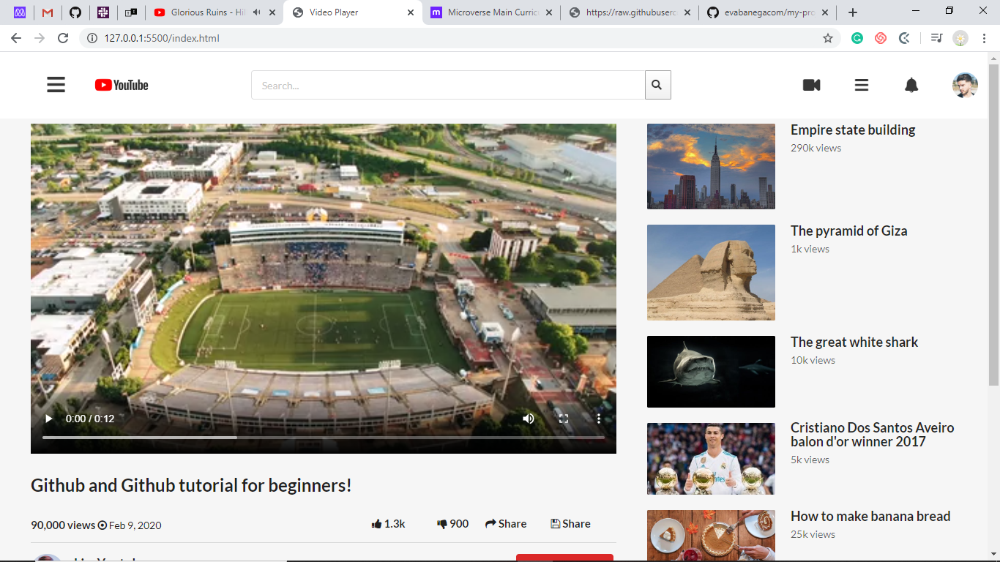

# Video Player

We built a youtube html page.

## Built With

- HTML & CSS,
- Semantic css frameworks,

## Live Demo

[Live Demo Link](https://livedemo.com)

To get a local copy up and running follow these simple example steps.

### Prerequisites
-Visual studio code editor.

## Authors

👤 **Rose**

- Github: (https://github.com/blackpintz)
- Twitter:(https://twitter.com/blackpintz)

👤 **Author2**

- Github: (https://github.com/evabanegacom)
- Linkedin:(https://www.linkedin.com/in/precious-udegbue-a3468314a/)

## 🤝 Contributing

Contributions, issues and feature requests are welcome!

Feel free to check the [issues page](issues/).

## Show your support

Give a ⭐️ if you like this project!

## Acknowledgments

- youtube stackshare
